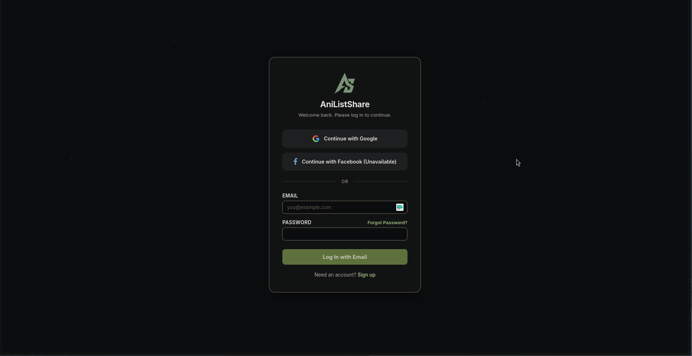
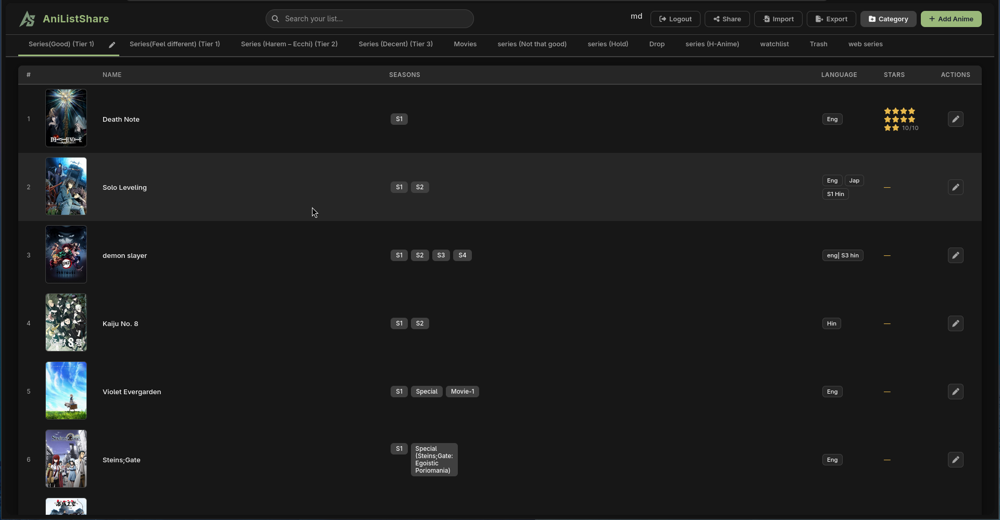

# AniListShare

A web app to manage your anime watchlist.

## Screenshots

## Featiures

- Tabbed categories imported from your ODS file
- Table view: thumbnail, name, seasons (with comments), language, stars (0–10)
- Anime search with MAL autocomplete & thumbnails
- Add, edit, delete, and reorder entries
- Add new categories on the fly
- And much more!

## Setup

Please refer to [SETUP.md](SETUP.md) to host it yourself
